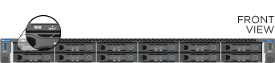

= Install H-series storage nodes
:icons: font
:imagesdir: ../media/

[.lead]
Before you get started with your all-flash storage system, you should install and set up the storage nodes correctly.

TIP: See the link:../media/hseries_isi.pdf[poster^] for a visual representation of the instructions.

* <<Workflow diagrams>>
* <<Prepare for installation>>
* <<Install the rails>>
* <<Install and cable the nodes>>
* <<Configure the nodes>>
* <<Create a cluster>>

== Workflow diagrams

The workflow diagrams here provide a high-level overview of the installation steps. The steps vary slightly depending on the H-series model.

=== H410S

image::../media/h410s_isi_workflow.png[H410S installation workflow]

=== H610S

NOTE: The terms "node" and "chassis" are used interchangeably in the case of H610S, because node and chassis are not separate components unlike in the case of a 2U, four-node chassis.

image::../media/h610s_isi_workflow.png[H610S installation workflow]

== Prepare for installation

In preparation for installation, inventory the hardware that was shipped to you, and contact NetApp Support if any of the items are missing.

Ensure that you have the following items at your installation location:

* Rack space for the system.

[%header,cols=2*]
|===
|Node type
|Rack space

|H410S nodes
|Two rack unit (2U)

|H610S nodes
|One rack unit (1U)
|===

* SFP28/SFP+ direct-attach cables or transceivers
* CAT5e or higher cables with RJ45 connector
* A keyboard, video, mouse (KVM) switch to configure your system
* USB stick (optional)

TIP: The hardware that is shipped to you depends on what you order. A new 2U, four-node order includes the chassis, bezel, slide rail kit, drives, storage nodes, and power cables (two per chassis). If you order H610S storage nodes, the drives come installed in the chassis.

CAUTION: While installing the hardware, ensure that you remove all packing material and wrapping from the unit. This will prevent the nodes from overheating and shutting down.

== Install the rails

The hardware order that was shipped to you includes a set of slide rails. You will need a screwdriver to complete the rail installation. The installation steps vary slightly for each node model.

TIP: Install hardware from the bottom of the rack up to the top to prevent the equipment from toppling over. If your rack includes stabilizing devices, install them before you install the hardware.

* <<H410S>>
* <<H610S>>

=== H410S
H410S nodes are installed in 2U, four-node H-Series chassis, which is shipped with two sets of adapters. If you want to install the chassis in a rack with round holes, use the adapters appropriate for a rack with round holes. The rails for H410S nodes fit a rack between 29 inches and 33.5 inches in depth. When the rail is fully contracted, it is 28 inches long, and the front and rear sections of the rail are held together by only one screw.

CAUTION: If you install the chassis onto a fully contracted rail, the front and rear sections of the rail might separate.

.Steps

. Align the front of the rail with the holes on the front post of the rack.
. Push the hooks on the front of the rail into the holes on the front post of the rack and then down, until the spring-loaded pegs snap into the rack holes.
. Attach the rail to the rack with screws. Here is an illustration of the left rail being attached to the front of the rack:
+
image::../media/h410s_rail.gif[Rail installation for 2U, four-node NetApp HCI chassis.]

. Extend the rear section of the rail to the rear post of the rack.
. Align the hooks on the rear of the rail with the appropriate holes on the rear post ensuring that the front and the back of the rail are on the same level.
. Mount the rear of the rail onto the rack, and secure the rail with screws.
. Perform all the above steps for the other side of the rack.

=== H610S
Here is an illustration for installing rails for an H610S storage node:

image::../media/h610s_rail_isi.gif[Rail installation for H610S storage node.]

TIP: There are left and right rails on the H610S. Position the screw hole towards the bottom so that the H610S thumbscrew can secure the chassis to the rail.

== Install and cable the nodes

You install the H410S storage node in a 2U, four-node chassis. For H610S, install the chassis/node directly onto the rails in the rack.

CAUTION: Remove all the packing material and wrapping from the unit. This prevents the nodes from overheating and shutting down.

* <<H410S>>
* <<H610S>>

=== H410S

.Steps

. Install the H410S nodes in the chassis. Here is a rear-view example of a chassis with four nodes installed:
+
image::../media/sf_isi_chassis_rear.png[This figure shows the back of a 2U, four-node chassis with the nodes called out.]
+
WARNING: Use caution while lifting the hardware and installing it into the rack. An empty two rack unit (2U), four-node chassis weighs 54.45 lb (24.7 kg) and a node weighs 8.0 lb (3.6 kg).

. Install the drives.
+
image::../media/hci_stor_node_ssd_bays.gif[This figure shows the front of the 2U, four-node chassis with the drive bays called out.]
. Cable the nodes.
+
IMPORTANT: If the airflow vents at the rear of the chassis are blocked by cables or labels, it can lead to premature component failures due to overheating.
+
image::../media/hci_isi_storage_cabling.png[This figure shows the cabling of an H410S storage node.]

** Connect two CAT5e or higher cables in ports A and B for management connectivity.
** Connect two SFP28/SFP+ cables or transceivers in ports C and D for storage connectivity.
** (Optional, recommended) connect a CAT5e cable in the IPMI port for out-of-band management connectivity.
. Connect the power cords to the two power supply units per chassis and plug them into 240V PDU or power outlet.
. Power on the nodes.
+
NOTE: It takes approximately six minutes for the node to boot.
+
image::../media/hci_poweron_isg.gif[This figure shows the power buttons on the nodes in the 2U, four-node chassis.]

=== H610S

.Steps

. Install the H610S chassis. Here is an illustration for installing the node/chassis in the rack:
+
image::../media/h610s_chassis_isi.gif[Shows the H610S node/chassis being installed in the rack.]
+
WARNING: Use caution while lifting the hardware and installing it into the rack. An H610S chassis weighs 40.5 lb (18.4 kg).

. Cable the nodes.
+
IMPORTANT: If the airflow vents at the rear of the chassis are blocked by cables or labels, it can lead to premature component failures due to overheating.
+
image::../media/h600s_isi_noderear.png[This figure shows the cabling of the H610S storage node.]

** Connect the node to a 10/25GbE network using two SFP28 or SFP+ cables.
** Connect the node to a 1GbE network using two RJ45 connectors.
** Connect the node to a 1GbE network using an RJ-45 connector in the IPMI port.
** Connect both power cables to the node.
. Power on the nodes.
+
NOTE: It takes approximately five minutes and 30 seconds for the node to boot.
+

== Configure the nodes
After you rack and cable the hardware, you are ready to configure your new storage resource.

.Steps

. Attach a keyboard and monitor to the node.
. In the terminal user interface (TUI) that is displayed, configure the network and cluster settings for the node by using the on-screen navigation.
+
NOTE: You should get the IP address of the node from the TUI. You need this when you add the node to a cluster. After you save the settings, the node is in a pending state, and can be added to a cluster. See the <insert link to Setup section>.

. Configure out-of-band management using the Baseboard Management Controller (BMC). These steps apply *only to H610S* nodes.
.. Use a web browser and navigate to the default BMC IP address: 192.168.0.120
.. Log in using *root* as the username and *calvin* as the password.
.. From the node management screen, navigate to *Settings* > *Network Settings*, and configure the network parameters for the out-of-band management port.

TIP: See https://kb.netapp.com/Advice_and_Troubleshooting/Hybrid_Cloud_Infrastructure/NetApp_HCI/How_to_access_BMC_and_change_IP_address_on_H610S[this KB article (log in required)].

== Create a cluster
After you add the storage node to your installation and configure the new storage resource, you are ready to create a new storage cluster

.Steps

. From a client on the same network as the newly configured node, access the NetApp Element software UI by entering the node's IP address.
. Enter the required information in the **Create a New Cluster** window.
See the link:../setup/concept_setup_overview.html[setup overview^] for more information.

== Find more information
* https://docs.netapp.com/us-en/element-software/index.html[SolidFire and Element Software Documentation]
* https://docs.netapp.com/sfe-122/topic/com.netapp.ndc.sfe-vers/GUID-B1944B0E-B335-4E0B-B9F1-E960BF32AE56.html[Documentation for earlier versions of NetApp SolidFire and Element products^]
