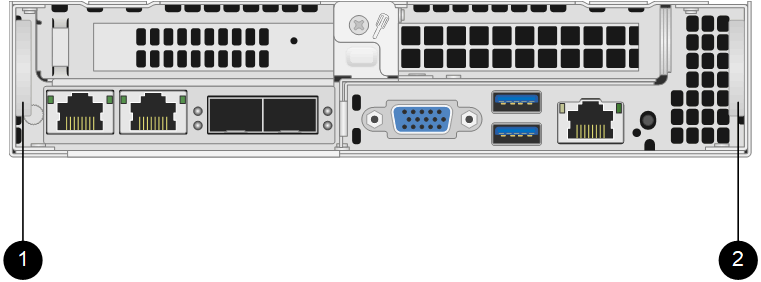

= Replace a H410S node
:icons: font
:imagesdir: ../media/

[.lead]
You should replace a storage node in the event of CPU failure, Radian card problems, other motherboard issues, or if it does not power on. The instructions apply to H410S storage nodes.

Alarms in the NetApp Element software UI alert you when a storage node fails. You should use the Element UI to get the serial number (service tag) of the failed node. You need this information to locate the failed node in the cluster.

Here is the back of a two rack unit (2U), four-node chassis with four storage nodes:

image::hci_stornode_rear.gif[This figure shows the four-node chassis with four storage nodes.]

Here is the front view of a four-node chassis with H410S nodes, showing the bays that correspond to each node:

image::hci_stor_node_ssd_bays.gif[Shows the bays associated with each node in a four-node chassis with H410S nodes.]

.What you'll need

* You have verified that your storage node is faulty and needs to be replaced.
* You have obtained a replacement storage node.
* You have an electrostatic discharge (ESD) wristband, or you have taken other antistatic protection.
* You have labeled each cable that is connected to the storage node.

Here is a high-level overview of the steps:

* <<Prepare to replace the node>>
* <<Replace the node in the chassis>>
* <<Add the node to the cluster>>

== Prepare to replace the node

You should remove the faulty storage node correctly from the cluster in the NetApp Element software UI before you install the replacement node. You can do this without causing any service interruption. You should obtain the serial number of the faulty storage node from the Element UI and match it with the serial number on the sticker at the back of the node.

.Steps

. In the Element UI, select *Cluster* > *Drives*.
. Remove the drives from the node using one of the following methods:
+
[%header,cols=2*]
|===
| Option| Steps
a|
To remove individual drives
a|

.. Click *Actions* for the drive you want to remove.
.. Click *Remove*.

a|
To remove multiple drives
a|

.. Select all the drives you want to remove, and click *Bulk Actions*.
.. Click *Remove*.
|===

. Select *Cluster* > *Nodes*.
. Note the serial number (service tag) of the faulty node. You should match it with the serial number on the sticker at the back of the node.
. After you note the serial number, remove the node from the cluster as follows:
.. Select the *Actions* button for the node you want to remove.
.. Select *Remove*.

== Replace the node in the chassis

After you remove the faulty node from the cluster using the NetApp Element software UI you are ready to physically remove the node from the chassis. You should install the replacement node in the same slot in the chassis from which you removed the failed node.

.Steps

. Wear antistatic protection before proceeding.
. Unpack the new storage node, and set it on a level surface near the chassis.
+
Keep the packaging material for when you return the faulty node to NetApp.

. Label each cable that is inserted at the back of the storage node that you want to remove.
+
After you install the new storage node, you should insert the cables into the original ports.
+
Here is an image showing the back of a storage node:
+
image::../media/hci_isi_storage_cabling.png[This figure shows the cabling of the storage node.]
+
[%header,cols=2*]
|===
| Port| Details
a|
Port A
a|
1/10GbE RJ45 port
a|
Port B
a|
1/10GbE RJ45 port
a|
Port C
a|
10/25GbE SFP+ or SFP28 port
a|
Port D
a|
10/25GbE SFP+ or SFP28 port
a|
IPMI
a|
1/10GbE RJ45 port
|===

. Disconnect all the cables from the storage node.
. Pull down the cam handle on the right side of the node, and pull the node out using both the cam handles.
+
The cam handle that you pull down has an arrow on it to indicate the direction in which it moves. The other cam handle does not move and is there to help you pull the node out.
+

+
[%header,cols=2*]
|===
| Item| Description
a|
1
a|
Cam handle to help you pull the node out.
a|
2
a|
Cam handle that you pull down before pulling the node out.
|===
+
NOTE: Support the node with both your hands when you pull it out of the chassis.

. Place the node on a level surface.
+
You must package the node and return it to NetApp.

. Install the replacement node in the same slot in the chassis.
+
IMPORTANT: Ensure that you do not use excessive force when sliding the node into the chassis.

. Move the drives from the node you removed and insert them in the new node.
. Reconnect the cables to the ports from which you originally disconnected them.
+
The labels you had on the cables when you disconnected them will help guide you.
+
[NOTE]
===============================

. If the airflow vents at the rear of the chassis are blocked by cables or labels, it can lead to premature component failures due to overheating.
. Do not force the cables into the ports; you might damage the cables, ports, or both.
===============================
+

TIP: Ensure that the replacement node is cabled in the same way as the other nodes in the chassis.

. Press the button at the front of the node to power it on.

== Add the node to the cluster

When you add a node to the cluster or install new drives in an existing node, the drives automatically register as available. You must add the drives to the cluster by using either the Element UI or API before they can participate in the cluster.

The software version on each node in a cluster should be compatible. When you add a node to a cluster, the cluster installs the cluster version of Element software on the new node as needed.

.Steps

. Select *Cluster* > *Nodes*.
. Select *Pending* to view the list of pending nodes.
. Do one of the following:
** To add individual nodes, select the *Actions* icon for the node you want to add.
** To add multiple nodes, select the check box of the nodes to add, and then *Bulk Actions*.
+
NOTE: If the node you are adding has a different version of Element software than the version running on the cluster, the cluster asynchronously updates the node to the version of Element software running on the cluster master. After the node is updated, it automatically adds itself to the cluster. During this asynchronous process, the node will be in a `pendingActive` state.

. Select *Add*.
+
The node appears in the list of active nodes.
. From the Element UI, select *Cluster* > *Drives*.
. Select *Available* to view the list of available drives.
. Do one of the following:
** To add individual drives, select the *Actions* icon for the drive you want to add, and then select *Add*.
** To add multiple drives, select the check boxes of the drives to add, select *Bulk Actions*, and then select *Add*.

== Find more information
* https://docs.netapp.com/us-en/element-software/index.html[SolidFire and Element Software Documentation]
* https://docs.netapp.com/sfe-122/topic/com.netapp.ndc.sfe-vers/GUID-B1944B0E-B335-4E0B-B9F1-E960BF32AE56.html[Documentation for earlier versions of NetApp SolidFire and Element products^]
