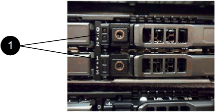

= Replace drives for SF-series storage nodes
:icons: font
:imagesdir: ../media/

[.lead]
You can hot-swap a failed solid-state drive with a replacement drive.

.What you'll need

* You have a replacement drive.
* You have an electrostatic discharge (ESD) wristband, or you have taken other antistatic precautions.
* You have contacted NetApp Support to verify that the SSD needs to be replaced and for help with the proper resolution procedure.
+
You will need the service tag or serial number when you call NetApp Support. Support will work with you to get a replacement drive according to your Service Level Agreement.

.About this task

The instructions apply to the following SolidFire storage node models:

* SF2405
* SF4805
* SF9605
* SF9608
* SF19210
* SF38410

[NOTE]
====
Depending on your Element software version, the following nodes are not supported:

* Beginning with Element 12.7, SF2405 and SF9608 storage nodes. 
* Beginning with Element 12.0, SF3010, SF6010, and SF9010 storage nodes.
====

The following figure shows the placement of the drives in an SF9605 chassis:

image::../media/sf_drives.gif[This figure shows the drives in the SolidFire chassis.]

NOTE: The above figure is an example. SF9608 has a different drive layout that includes only eight drives that are numbered one through eight, from left to right.

Slot 0 holds the metadata drive for the node. If you are replacing the drive in slot 0, you must attach the sticker included in the shipping box on the replacement drive, so that you can identify it separately from the rest.

[NOTE]
===============================
Follow these best practices while handling drives:

* Prevent electrostatic discharge (ESD) by keeping the drive in the ESD bag until you are ready to install it.
* Do not insert a metal tool or knife into the ESD bag.
* Open the ESD bag by hand or cut the top off with a pair of scissors.
* Keep the ESD bag and any packing materials in case you must return a drive later.
* Always wear an ESD wrist strap grounded to an unpainted surface on your chassis.
* Always use both hands when removing, installing, or carrying a drive.
* Never force a drive into the chassis.
* Do not stack drives on top of each other.
* Always use approved packaging when shipping drives.
===============================

Here is a high-level overview of the steps:

* <<Remove the drive from the cluster>>
* <<Replace the drive from the chassis>>
* <<Add the drive to the cluster>>

== Remove the drive from the cluster

The SolidFire system puts a drive in a failed state if the drive's self-diagnostics tells the node it has failed or if communication with the drive stops for five and a half minutes or longer. The system displays a list of the failed drives. You should remove a failed drive from the failed drive list in NetApp Element software.

.Steps

. In the Element UI, select *Cluster* > *Drives*.
. Select *Failed* to view the list of failed drives.
. Note the slot number of the failed drive.
+
You need this information to locate the failed drive in the chassis.

. Remove the failed drive using one of the following methods:
+
[%header,cols=2*]
|===
| Option| Steps
a|
To remove individual drives
a|

 .. Select *Actions* for the drive you want to remove.
 .. Select *Remove*.

a|
To remove multiple drives
a|

 .. Select all the drives you want to remove, and the select *Bulk Actions*.
 .. Select *Remove*.
|===

== Replace the drive from the chassis

After you remove a failed drive from the failed drive list in the Element UI, you are ready to physically replace the failed drive from the chassis.

.Steps

. Unpack the replacement drive, and place it on a flat, static-free surface near the rack.
+
Save the packing materials for when you return the failed drive to NetApp.

. Match the slot number of the failed drive from the Element UI with the number on the chassis.
+
The following figure is an example to show the numbering of the drive slots:
+

+
[%header,cols=2*]
|===
|Item
|Description

a|
1
a|
Drive slot numbers
|===

. Press the red circle on the drive you want to remove to release the drive.
+
The latch clicks open.

. Slide the drive out of the chassis, and place it on a static-free, level surface.
. Press the red circle on the replacement drive before you slide it into the slot.
. Insert the replacement drive, and press the red circle to close the latch.
. Notify NetApp Support about the drive replacement.
+
NetApp Support will provide instructions for returning the failed drive.

== Add the drive to the cluster

After you install a new drive in the chassis, it registers as available. You should add the drive to the cluster using the Element UI before it can participate in the cluster.

.Steps

. In the Element UI, click *Cluster* > *Drives*.
. Click *Available* to view the list of available drives.
. Choose one of the following options to add drives:
+
[%header,cols=2*]
|===
| Option| Steps
a|
To add individual drives
a|

 .. Select the *Actions* button for the drive you want to add.
 .. Select *Add*.

a|
To add multiple drives
a|

 .. Select the check boxes of the drives to add, and then select *Bulk Actions*.
 .. Select *Add*.
|===

== Find more information
* https://docs.netapp.com/us-en/element-software/index.html[SolidFire and Element Software Documentation]
* https://docs.netapp.com/sfe-122/topic/com.netapp.ndc.sfe-vers/GUID-B1944B0E-B335-4E0B-B9F1-E960BF32AE56.html[Documentation for earlier versions of NetApp SolidFire and Element products^]
