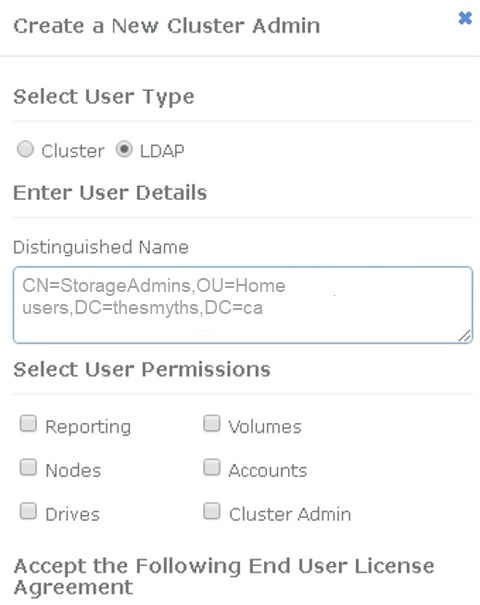

= Manage LDAP
:icons: font
:imagesdir: ../media/

[.lead]
You can set up the Lightweight Directory Access Protocol (LDAP) to enable secure, directory-based login functionality to SolidFire storage. You can configure LDAP at the cluster level and authorize LDAP users and groups.

Managing LDAP involves setting up LDAP authentication to a SolidFire cluster using an existing Microsoft Active Directory environment and testing the configuration.

NOTE: You can use both IPv4 and IPv6 addresses.

Enabling LDAP involves the following high-level steps, described in detail:

. *Complete pre-configuration steps for LDAP support*. Validate that you have all of the details required to configure LDAP authentication.
. *Enable LDAP authentication*. Use either the Element UI or the Element API.
. *Validate the LDAP configuration*. Optionally, check that the cluster is configured with the correct values by running the GetLdapConfiguration API method or by checking the LCAP configuration using the Element UI.
. *Test the LDAP authentication* (with the `readonly` user). Test that the LDAP configuration is correct either by running the TestLdapAuthentication API method or by using the Element UI. For this initial test, use the username "`sAMAccountName`" of the `readonly` user. This will validate that your cluster is configured correctly for LDAP authentication and also validate that the `readonly` credentials and access are correct. If this step fails, repeat steps 1 through 3.
. *Test the LDAP authentication* (with a user account that you want to add). Repeat setp 4 with a user account that you want to add as an Element cluster admin. Copy the `distinguished` name (DN) or the user (or the group). This DN will be used in step 6.
. *Add the LDAP cluster admin* (copy and paste the DN from the Test LDAP authentication step). Using either the Element UI or the AddLdapClusterAdmin API method, create a new cluster admin user with the appropriate access level. For the username, paste in the full DN you copied in Step 5. This assures that the DN is formatted correctly.
. *Test the cluster admin access*. Log in to the cluster using the newly created LDAP cluster admin user. If you added an LDAP group, you can log in as any user in that group.

== Complete pre-configuration steps for LDAP support

Before you enable LDAP support in Element, you should set up a Windows Active Directory Server and perform other pre-configuration tasks.

.Steps

. Set up a Windows Active Directory Server.
. *Optional:* Enable LDAPS support.
. Create users and groups.
. Create a read-only service account (such as "`sfreadonly`") to be used for searching the LDAP directory.

== Enable LDAP authentication with the Element user interface

You can configure storage system integration with an existing LDAP server. This enables LDAP administrators to centrally manage storage system access for users.

You can configure LDAP with either the Element user interface or the Element API. This procedure describes how to configure LDAP using the Element UI.

This example shows how to configure LDAP authentication on SolidFire and it uses `SearchAndBind` as the authentication type. The example uses a single Windows Server 2012 R2 Active Directory Server.

.Steps

. Click *Cluster* > *LDAP*.
. Click *Yes* to enable LDAP authentication.
. Click *Add a Server*.
. Enter the *Host Name/IP Address*.
+
NOTE: An optional custom port number can also be entered.
+
For example, to add a custom port number, enter <host name or ip address>:<port number>

. *Optional:* Select *Use LDAPS Protocol*.
. Enter the required information in *General Settings*.
+
//link:reference_system_manage_ldap_details.md#[LDAP details]
+
image::../media/element_new_ldap_servers.jpg[]

. Click *Enable LDAP*.
. Click *Test User Authentication* if you want to test the server access for a user.
. Copy the distinguished name and user group information that appears for use later when creating cluster administrators.
. Click *Save Changes* to save any new settings.
. To create a user in this group so that anyone can log in, complete the following:
 .. Click *User* > *View*.
+

 .. For the new user, click *LDAP* for the User Type, and paste the group you copied to the Distinguished Name field.
 .. Select the permissions, typically all permissions.
 .. Scroll down to the End User License Agreement and click *I accept*.
 .. Click *Create Cluster Admin*.
+
Now you have a user with the value of an Active Directory group.

To test this, log out of the Element UI and log back in as a user in that group.

== Enable LDAP authentication with the Element API

You can configure storage system integration with an existing LDAP server. This enables LDAP administrators to centrally manage storage system access for users.

You can configure LDAP with either the Element user interface or the Element API. This procedure describes how to configure LDAP using the Element API.

To leverage LDAP authentication on a SolidFire cluster, you enable LDAP authentication first on the cluster using the `EnableLdapAuthentication` API method.

.Steps

. Enable LDAP authentication first on the cluster using the `EnableLdapAuthentication` API method.
. Enter the required information.
+
----
{
     "method":"EnableLdapAuthentication",
     "params":{
          "authType": "SearchAndBind",
          "groupSearchBaseDN": "dc=prodtest,dc=solidfire,dc=net",
          "groupSearchType": "ActiveDirectory",
          "searchBindDN": "SFReadOnly@prodtest.solidfire.net",
          "searchBindPassword": "ReadOnlyPW",
          "userSearchBaseDN": "dc=prodtest,dc=solidfire,dc=net ",
          "userSearchFilter": "(&(objectClass=person)(sAMAccountName=%USERNAME%))"
          "serverURIs": [
               "ldap://172.27.1.189",
          [
     },
  "id":"1"
}
----

. Change the values of the following parameters:
+
[cols=2*,options="header"]
|===
| Parameters used| Description
a|
authType: SearchAndBind
a|
Dictates that the cluster will use the readonly service account to first search for the user being authenticated and subsequently bind that user if found and authenticated.
a|
groupSearchBaseDN: dc=prodtest,dc=solidfire,dc=net
a|
Specifies the location in the LDAP tree to begin searching for groups. For this example, we've used the root of our tree. If your LDAP tree is very large, you might want to set this to a more granular sub-tree to decrease search times.
a|
userSearchBaseDN: dc=prodtest,dc=solidfire,dc=net
a|
Specifies the location in the LDAP tree to begin searching for users. For this example, we've used the root of our tree. If your LDAP tree is very large, you might want to set this to a more granular sub-tree to decrease search times.
a|
groupSearchType: ActiveDirectory
a|
Uses the Windows Active Directory server as the LDAP server.
a|
----
userSearchFilter:
“(&(objectClass=person)(sAMAccountName=%USERNAME%))”
----

To use the userPrincipalName (email address for login) you could change the userSearchFilter to:

----
“(&(objectClass=person)(userPrincipalName=%USERNAME%))”
----

Or, to search both userPrincipalName and sAMAccountName, you can use the following userSearchFilter:

----
“(&(objectClass=person)(|(sAMAccountName=%USERNAME%)(userPrincipalName=%USERNAME%)))”
----
a|
Leverages the sAMAccountName as our username for logging in to the SolidFire cluster. These settings tell LDAP to search for the username specified during login in the sAMAccountName attribute and also limit the search to entries that have "`person`" as a value in the objectClass attribute.
a|
searchBindDN
a|
This is the distinguished name of readonly user that will be used to search the LDAP directory. For active directory it's usually easiest to use the userPrincipalName (email address format) for the user.
a|
searchBindPassword
a|
This is the password for the readonly user account.
|===

To test this, log out of the Element UI and log back in as a user in that group.

[[view_ldap_details]]
== View LDAP details

View LDAP information on the LDAP page on the Cluster tab.

NOTE: You must enable LDAP to view these LDAP configuration settings.

. To view LDAP details with the Element UI, click *Cluster* > *LDAP*.
+
* *Host Name/IP Address*: Address of an LDAP or LDAPS directory server.
* *Auth Type*: The user authentication method. Possible values:
 ** Direct Bind
 ** Search And Bind
* *Search Bind DN*: A fully qualified DN to log in with to perform an LDAP search for the user (needs bind-level access to the LDAP directory).
* *Search Bind Password*: Password used to authenticate access to the LDAP server.
* *User Search Base DN*: The base DN of the tree used to start the user search. The system searches the subtree from the specified location.
* *User Search Filter*: Enter the following using your domain name:
+
`(&(objectClass=person)(|(sAMAccountName=%USERNAME%)(userPrincipalName=%USERNAME%)))`

* *Group Search Type*: Type of search that controls the default group search filter used. Possible values:
 ** Active Directory: Nested membership of all of a user's LDAP groups.
 ** No Groups: No group support.
 ** Member DN: Member DN-style groups (single-level).
* *Group Search Base DN*: The base DN of the tree used to start the group search. The system searches the subtree from the specified location.
* *Test User Authentication*: After LDAP is configured, use this to test the user name and password authentication for the LDAP server. Enter an account that already exists to test this. The distinguished name and user group information appears, which you can copy for later use when creating cluster administrators.

== Test the LDAP configuration

After configuring LDAP, you should test it by using either the Element UI or the Element API `TestLdapAuthentication` method.

.Steps

. To test the LDAP configuration with the Element UI, do the following:
 .. Click *Cluster* > *LDAP*.
 .. Click *Test LDAP Authentication*.
 .. Resolve any issues by using the information in the table below:
+
[cols=2*,options="header"]
|===
| Error message| Description
a|
        xLDAPUserNotFound
a|

  *** The user being tested was not found in the configured `userSearchBaseDN` subtree.
  *** The `userSearchFilter` is configured incorrectly.

a|
        xLDAPBindFailed (Error: Invalid credentials)
a|

  *** The username being tested is a valid LDAP user, but the password provided is incorrect.
  *** The username being tested is a valid LDAP user, but the account is currently disabled.

a|
        xLDAPSearchBindFailed (Error: Can't contact LDAP server)
a|
The LDAP server URI is incorrect.
a|
        xLDAPSearchBindFailed (Error: Invalid credentials)
a|
The read-only username or password is configured incorrectly.
a|
        xLDAPSearchFailed (Error: No such object)
a|
The `userSearchBaseDN` is not a valid location within the LDAP tree.
a|
        xLDAPSearchFailed (Error: Referral)
a|

  *** The `userSearchBaseDN` is not a valid location within the LDAP tree.
  *** The `userSearchBaseDN` and `groupSearchBaseDN` are in a nested OU. This can cause permission issues. The workaround is to include the OU in the user and group base DN entries, (for example: `ou=storage, cn=company, cn=com`)

+
|===
. To test the LDAP configuration with the Element API, do the following:
 .. Call the TestLdapAuthentication method.
+
----
{
  "method":"TestLdapAuthentication",
     "params":{
        "username":"admin1",
        "password":"admin1PASS
      },
      "id": 1
}
----

 .. Review the results. If the API call is successful, the results include the specified user's distinguished name and a list of groups in which the user is a member.
+
----
{
"id": 1
     "result": {
         "groups": [
              "CN=StorageMgmt,OU=PTUsers,DC=prodtest,DC=solidfire,DC=net"
         ],
         "userDN": "CN=Admin1 Jones,OU=PTUsers,DC=prodtest,DC=solidfire,DC=net"
     }
}
----

== Disable LDAP

You can disable LDAP integration using the Element UI.

Before you begin, you should note all the configuration settings, because disabling LDAP erases all settings.

.Steps

. Click *Cluster* > *LDAP*.
. Click *No*.
. Click *Disable LDAP*.

== Find more information
* https://docs.netapp.com/us-en/element-software/index.html[SolidFire and Element Software Documentation]
* https://docs.netapp.com/us-en/vcp/index.html[NetApp Element Plug-in for vCenter Server^]
