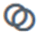

= Icons in the Element interface
:icons: font
:imagesdir: ../media/

[.lead]
The NetApp Element software interface displays icons to represent actions you can take on system resources.

The following table provides a quick reference:

|===
| Icon| Description
a|
image:../media/element_icon_action.gif[Actions icon in Element OS web UI]
a|
Actions
a|
image:../media/element_icon_backupto.gif[Backupto icon in Element OS web UI]
a|
Backup to
a|

a|
Clone or copy
a|
image:../media/element_icon_delete.gif[Delete icon in Element OS web UI]
a|
Delete or purge
a|

a|
Edit
a|
image:../media/element_icon_filter.gif[Filter icon in Element OS web UI]
a|
Filter
a|

a|
Pair
a|
image:../media/element_icon_refresh.gif[Refresh icon in Element OS web UI]
a|
Refresh
a|
image:../media/element_icon_restore.gif[Restore icon in Element OS web UI]
a|
Restore
a|
image:../media/element_icon_restorefrom.gif[Restore from icon in Element OS web UI]
a|
Restore from
a|
image:../media/element_icon_rollback.gif[Rollback icon in Element OS web UI]
a|
Rollback
a|
image:../media/element_icon_snapshot.gif[Snapshot icon in Element OS web UI]
a|
Snapshot
|===
